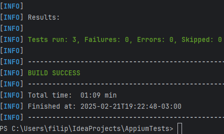

# Appium Test Automation Project 📱🤖

Este projeto tem como objetivo validar o aplicativo **my-demo-app-android** da **Sauce Labs**, sendo uma iniciativa de estudo e contribuição para a comunidade.

O aplicativo simula uma loja virtual com produtos disponíveis, carrinho de compras e checkout completo.

---

## 📌 Cenários Implementados

- ✅ **testLoginLogout**: Realiza login e logout no aplicativo.
- ✅ **testCheckoutSuccess**: Adiciona itens ao carrinho, finaliza o checkout informando todas as informações de cadastro, endereço e forma de pagamento, e completa a compra.
- ✅ **testAddToCart**: Testa a adição de itens ao carrinho e valida as telas com quantidades de produtos.

---

## 🚀 Tecnologias Utilizadas

- ⚙️ **Appium**: Framework de automação de testes para dispositivos móveis.
- ☕ **Java**: Linguagem de programação utilizada para desenvolver os testes.
- 🔬 **JUnit**: Framework de testes utilizado para executar os testes automatizados.
- 📦 **Maven**: Gerenciador de dependências e build do projeto.
- 📱 **Android Emulator/Dispositivo**: Para execução dos testes em dispositivos Android.

---

## ⚙️ Pré-requisitos

Antes de executar os testes, você precisa garantir que o seguinte esteja instalado no seu ambiente de desenvolvimento:

- ☕ **Java 11 ou superior**: Para compilar e rodar o código.
- 📦 **Maven**: Para gerenciar as dependências do projeto.
- 🤖 **Appium**: Para executar os testes automatizados.
- 📲 **Android SDK**: Para interagir com dispositivos Android, incluindo emuladores.
- 📱 **Emulador Android ou Dispositivo Real**: Para executar os testes.

---

## 💻 Como Rodar o Projeto

### 1️⃣ Clone o repositório

Clone o repositório para o seu ambiente local:

```bash
git clone https://github.com/seu-usuario/appium-tests.git
cd appium-tests

```

### 2️⃣ Instale as dependências

Utilize o Maven para instalar as dependências do projeto:

```bash
mvn clean install

```

### 3️⃣ Execute o servidor Appium

Abra o terminal e inicie o servidor Appium. Caso não tenha o Appium instalado, instale via NPM:

```bash
npm install -g appium

```

Inicie o servidor Appium:

```bash
appium

```

### 4️⃣ Execute os testes

Com o servidor Appium em execução e o ambiente configurado, você pode rodar os testes utilizando o Maven:

```bash
mvn test

```
Os testes serão executados no emulador Android configurado, e você verá os resultados diretamente no console.

## 📂 Estrutura do Projeto

A estrutura do projeto é organizada da seguinte forma:

- 📂 **Core:** Contém os arquivos de configuração do projeto e classes utilitárias que são utilizadas em todo o projeto
- 📂 **Dto:** Contém as classes que representam objetos que trafegam os dados entre os testes
- 📂 **Pages:** Classes para representar as páginas e suas interações.
- 📂 **Tests:** Testes end-to-end.

## 💡 Dicas
A estrutura do projeto é organizada da seguinte forma:

- 📱 **Emulador Android:** Se você estiver usando um emulador, certifique-se de que o emulador esteja em execução antes de rodar os testes.
- 🔌 **Dispositivos Reais:** Para dispositivos reais, certifique-se de que a depuração USB esteja ativada no dispositivo e que o dispositivo esteja conectado ao seu computador.
- 🛠️ **Erros Comuns:** Caso os testes não funcionem como esperado, verifique o arquivo de log do Appium para identificar problemas com o emulador, o driver ou o dispositivo.

## 🏗️ Integração com GitHub Actions
Este projeto utiliza GitHub Actions para executar os testes automaticamente em um ambiente CI/CD.

### 📜 Pipeline de Automação
A pipeline realiza os seguintes passos:

- 🔄 Checkout do código.
- 🛠️ Habilitação do KVM para rodar emuladores Android.
- 📦 Instalação do Appium e drivers necessários.
- 🚀 Inicialização do servidor Appium.
- 📲 Execução dos testes em um emulador Android usando o Maven.
- 📤 Upload dos resultados dos testes gerados pelo Surefire.

## 📊 Relatório de execução dos testes
Os relatórios de execução são gerados automaticamente utilizando o Surefire Report Plugin, e os resultados ficam disponíveis dentro da pasta target/reports.
Você pode baixar os reports gerados diretamente na aba Actions e clicando na última execução de testes.

(Testes que foram executados de forma local)



## 🤝 Contribuições 

Você pode explorar este projeto e aprender sobre a implementação de testes end-to-end com Appium. Qualquer contribuição é bem-vinda!

## 📜 Licença 

Este projeto não possui uma licença formal, mas é de código aberto para fins educacionais.
